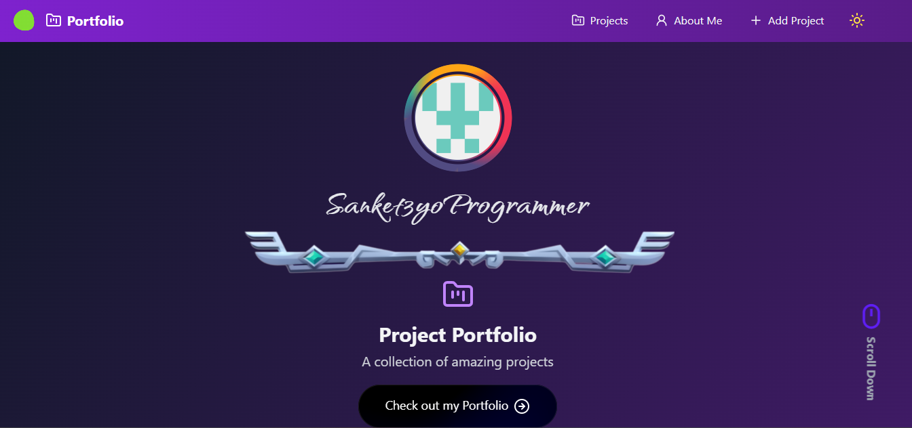

# Portfolio Projects

A modern, responsive portfolio project showcase built with React, TypeScript, and Tailwind CSS.



## Features

- **Modern UI Design**: Clean, responsive interface with animations
- **Project Cards**: Showcase your projects with details like languages, difficulty, and status
- **Static JSON Data**: Easy to update and maintain your project list
- **Responsive Layout**: Works perfectly on mobile, tablet, and desktop
- **Dark Theme**: Sleek dark color scheme with purple accents

## Getting Started

### Prerequisites

- Node.js 14.x or higher
- npm or yarn

### Installation

1. Clone the repository:
   ```bash
   git clone https://github.com/sanket3yoprogrammer/portfolio-projects.git
   cd portfolio-projects
   ```

2. Install dependencies:
   ```bash
   npm install
   # or
   yarn
   ```

3. Start the development server:
   ```bash
   npm run dev
   # or
   yarn dev
   ```

4. Open your browser and navigate to `http://localhost:5173`

## Customizing Projects

Projects are stored in `src/projects.json`. Edit this file to add, remove, or modify projects:

```json
{
  "id": "1",
  "name": "Project Name",
  "description": "Project description goes here...",
  "bannerImage": "URL to banner image",
  "languages": ["JavaScript", "React"],
  "difficulty": "Intermediate",
  "status": "Completed",
  "projectType": "Web Application",
  "liveUrl": "https://your-project-url.com",
  "githubUrl": "https://github.com/yourusername/project-repo"
}
```

## Building for Production

To build the application for production:

```bash
npm run build
# or
yarn build
```

## License

This project is licensed under the MIT License - see the LICENSE file for details. 